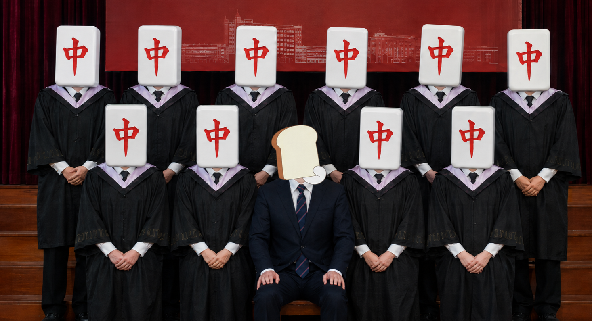
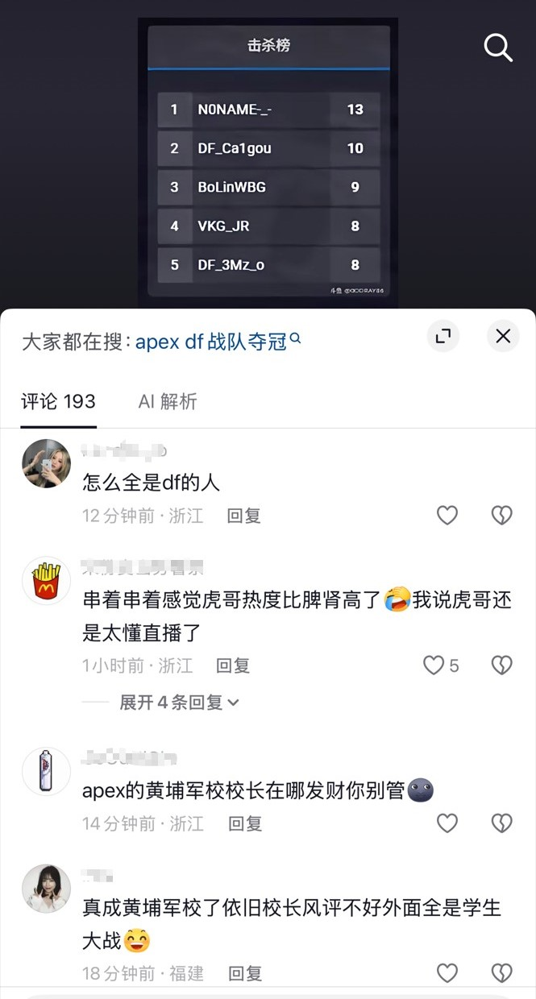

### 简介

”黄埔军校“是3mz粉丝对3mz的吹嘘言论

意指3mz培养了大量新人，为cnapex注入了大量新鲜血液

实则为假，3mz真正的带的新人只有3mz自己和Caca

### 言论示例

### 总结图

| 选手                            | 出道队伍及时间                 | 进入DF前的代表成绩         | 在DF服役时间                    | 在DF的代表成绩              | 离开DF的代表成绩  |
| ------------------------------- | ------------------------------ | -------------------------- | ------------------------------- | --------------------------- | ----------------- |
| 3mz    | DF（2019-05-28）               | 未打比赛                   | 2019-05-28 — Present            | 23冠军赛第7                 | 在役，未离开DF    |
| XiaoKai                         | EHOME（2019-06-04）            | E亚洲邀请赛第19            | 2019-10-11 — 2020-03-27         | 21冠军赛第13（线上-亚太南） | Y4-S2常规赛第3    |
| CacaLL | DF（2019-11-30）               | 未打比赛                   | 2019-11-30 — 2021-10-02         | 20夏季常规赛第2             | 禁赛              |
| Yus                             | IG（2020-02-20）               | 20夏季赛决赛第4            | 2021-02-27 — 2021-06-10         | 21冠军赛第13（线上-亚太南） | 21斗鱼邀请赛S2第2 |
| Xzz                             | IG（2021-01-21）               | FFL邀请赛S4第19            | 2021-06-20 — 2021-10-24（替补） | Y2-S1常规赛第4              | Y4-S1常规赛冠军   |
| Jacky1                          | BLG（2019-03-29）              | E亚洲邀请赛冠军            | 2021-09-25 — 2021-11-15（替补） | Y2-S1常规赛第4              | Y4-S2线下赛第22   |
| Roieee                          | NovaMS（2019-06-29）           | 21冠军赛第9（线上-亚太南） | 2021-10-20 — 2024-04-17         | 23冠军赛第7                 | Y6-S1常规赛第5    |
| Pite                            | GS（2019-12-??）               | 星空杯S1第3                | 2021-10-25 — 2025-05-15         | 23冠军赛第7                 | Y6-S1常规赛第4    |
| Noname                          | MDYB（2022-03-11）             | Y3-S2常规赛第10            | 2024-05-14 — 2025-02-11         | Y4-S2线下赛第13             | 25EWC第5          |
| Return                          | FTD（2021-09-13）              | 斗鱼捍卫者杯S1第3          | 2025-04-12 — 2025-05-15         | Y5-S1常规赛第8              | Y6-S1常规赛第14   |
| BoLin                           | AFTERMATH Taiwan（2021-07-23） | Y3-S2常规赛第8             | 2025-08-20 — 2026-04-09         | Y5-S2常规赛第13             | ENC亚太南第21     |
| Zhouzhou                        | shadow3690（2023-10-14）       | Y4-S2线下赛第22            | 2025-08-22 — 2026-02-24         | Y5-S2常规赛第13             | 离开DF没打比赛    |
| JR                              | XNY（2022-05-15）              | Y5-S1常规赛第3             | 2026-02-24 — 2026-04-09         | Y6-S1常规赛第23             | RIG杯#11第3       |
| Caigou                          | HarD（2025-08-15）             | Y6-S1常规赛第21            | 2026-08-07 — Present            | ENC亚太南第10               | 在役，未离开DF    |
| OWO                             | StinkyB（2021-01-20）          | 21冠军赛第9（线上-亚太南） | 2026-08-07 — Present            | 还没打比赛                  | 在役，未离开DF    |

注1：真正符合”黄埔军校“的DF选手，在表格内选手名已用红色字体标出

注2：部分选手未录入，由于确实过于远古/没名气，或者在DF打的时间过短

注3：Caigou的液体百科页面错误，出道队伍没录入，甚至Goat都未录入

### 参考文献

1. DF液体百科：https://liquipedia.net/apexlegends/DreamFire
2. 3mz液体百科：https://liquipedia.net/apexlegends/3Mz
3. 3mz成绩：https://liquipedia.net/apexlegends/3Mz/Results
4. XiaoKai液体百科：https://liquipedia.net/apexlegends/XiaoKai
5. XiaoKai成绩：https://liquipedia.net/apexlegends/XiaoKai/Results
6. CacaLL液体百科：https://liquipedia.net/apexlegends/CacaLL
7. CacaLL成绩：https://liquipedia.net/apexlegends/CacaLL/Results
8. Yus液体百科：https://liquipedia.net/apexlegends/Yus
9. Yus成绩：https://liquipedia.net/apexlegends/Yus/Results
10. Xzz液体百科：https://liquipedia.net/apexlegends/Xzz
11. Xzz成绩：https://liquipedia.net/apexlegends/Xzz/Results
12. Jacky1液体百科：https://liquipedia.net/apexlegends/Jacky1
13. Jacky1成绩：https://liquipedia.net/apexlegends/Jacky1/Results
14. Roieee液体百科：https://liquipedia.net/apexlegends/Roieee
15. Roieee成绩：https://liquipedia.net/apexlegends/Roieee/Results
16. Pite液体百科：https://liquipedia.net/apexlegends/Pite
17. Pite成绩：https://liquipedia.net/apexlegends/Pite/Results
18. Noname液体百科：https://liquipedia.net/apexlegends/Noname
19. Noname成绩：https://liquipedia.net/apexlegends/Noname/Results
20. Return液体百科：https://liquipedia.net/apexlegends/Return
21. Return成绩：https://liquipedia.net/apexlegends/Return/Results
22. BoLin液体百科：https://liquipedia.net/apexlegends/BoLin
23. BoLin成绩：https://liquipedia.net/apexlegends/BoLin/Results
24. Zhouzhou液体百科：https://liquipedia.net/apexlegends/Zhouzhou
25. Zhouzhou成绩：https://liquipedia.net/apexlegends/Zhouzhou/Results
26. JR液体百科：https://liquipedia.net/apexlegends/JR
27. JR成绩：https://liquipedia.net/apexlegends/JR/Results
28. Caigou液体百科：https://liquipedia.net/apexlegends/Caigou
29. Caigou成绩：https://liquipedia.net/apexlegends/Caigou/Results
30. OWO液体百科：https://liquipedia.net/apexlegends/OWO
31. OWO成绩：https://liquipedia.net/apexlegends/OWO/Results
