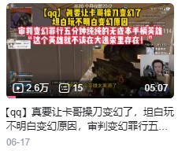
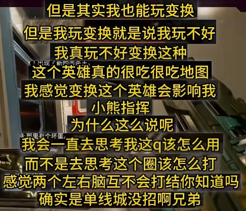
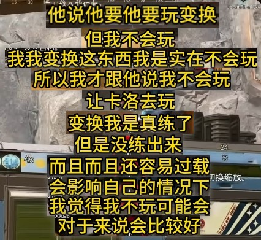

### 简介

”QQ在VKG其实会玩变换，只是卡莎不让玩“

QQ离开VKG后在WOL玩变换成绩不错，大量ylg拿QQ在WOL的表现否定旧VKG卡莎的表现

实则纯为经典的岁月史书打法，拿现在否定过去

“现在会玩那过去肯定会玩”

### 言论示例

### 真实历史

按时间顺序：

4.11：QQ在常规赛玩变换打出优秀表现

5.2：版本变动，变换大削，卡莎提前尝试变阵，胖胖鸡的表现也不错

6.17：QQ解释为什么自己玩不了变换。

QQ提到卡莎非常想玩变换，但自己不会玩。QQ确实练了半个月变换但真的没练出来，用变换会影响到自己的小圈

最后也提到变换的不合理，让卡莎试试他自己能不能玩变换

6.27：卡变换一坨，玩不了

### 参考文献

1. 言论出处【评论区】：https://www.bilibili.com/video/BV1vRtq6MEhx
1. Y6-S1，QQ常规赛变换吃鸡：https://www.bilibili.com/video/BV1ufQMBiEzg
1. 2026.5.5版本变动：https://www.bilibili.com/video/BV1NxRBBHEYt
1. 卡莎解释变阵胖胖鸡：https://www.bilibili.com/video/BV1LhREBjEpT
1. QQ解释为什么掏不出变换：https://www.bilibili.com/video/BV1ZdLQ6SEz4
1. 卡变换退役：https://www.bilibili.com/video/BV1ps7J6zECz
