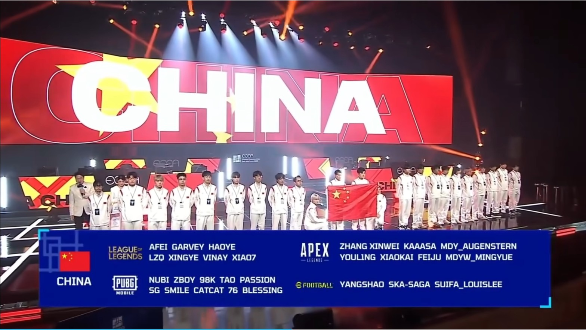
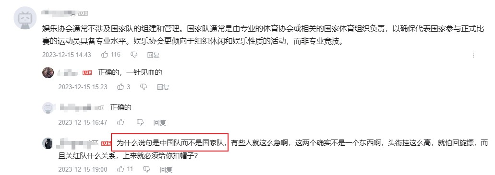
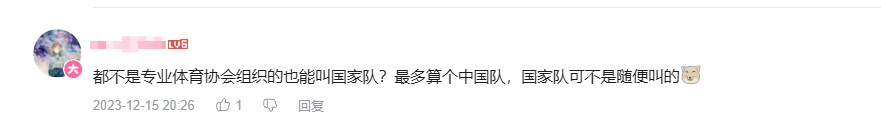
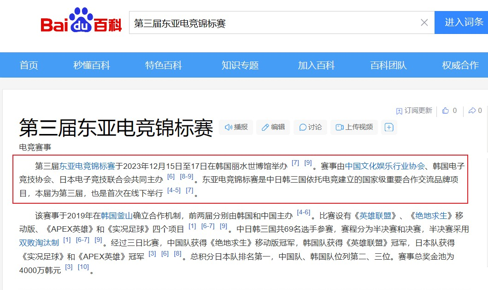
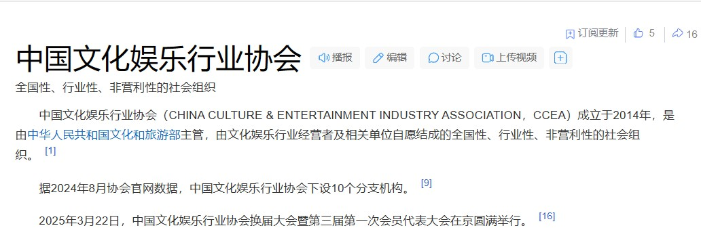
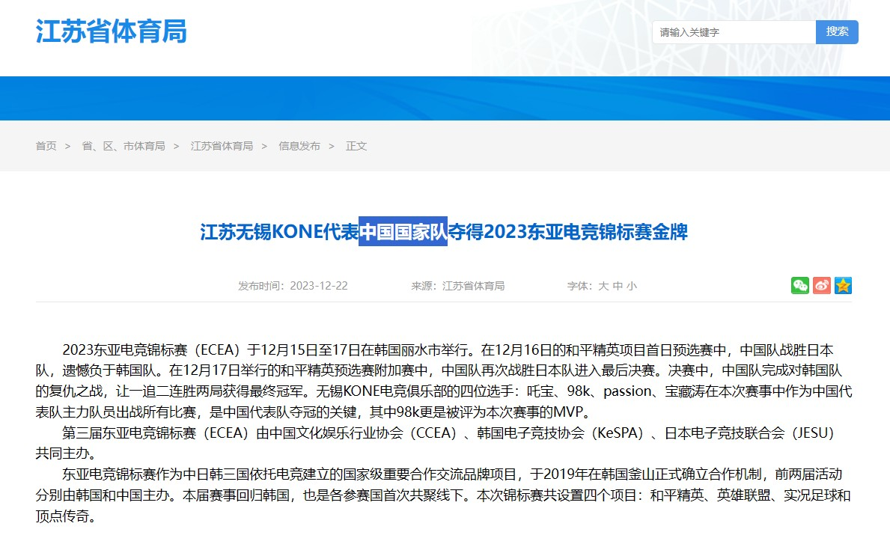
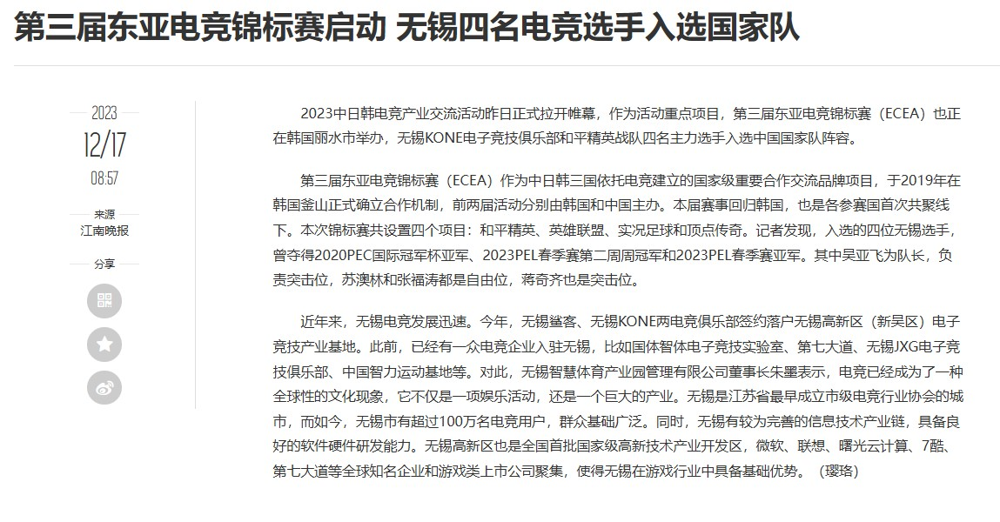

### 简介

”都不是专业体育协会组织的也能叫国家队？最多算个中国队，国家队可不是随便叫的“

2023年12月16日，飞天狙，五更明月，卡莎，小凯，幽灵，凤凰，6人代表中国国家队参加本次比赛

DF系没有一人参加，6人全为MDY系选手

DF系粉丝为降低此次比赛在国家层面的高度，禁止此次cn代表队自称国家队，只允许称为中国队

### 言论示例

### 真实情况

先看举办方：

第三届东亚电竞锦标赛于2023年12月15日至17日在韩国丽水世博馆举办 。赛事由中国文化娱乐行业协会、韩国电子竞技协会、日本电子竞技联合会共同主办。东亚电竞锦标赛是中日韩三国依托电竞建立的国家级重要合作交流品牌项目，本届为第三届，也是首次在线下举行

 

中国文化娱乐行业协会（CHINA CULTURE & ENTERTAINMENT INDUSTRY ASSOCIATION，CCEA）成立于2014年，是由中华人民共和国文化和旅游部主管，由文化娱乐行业经营者及相关单位自愿结成的全国性、行业性、非营利性的社会组织。

再看报道文件：

江苏省体育局：“中国国家队”

无锡新传媒/江南晚报：“国家队”

### 参考文献

1. 第三届东亚电竞锦标赛_百度百科：https://baike.baidu.com/item/第三届东亚电竞锦标赛
1. 中国文化娱乐行业协会_百度百科：https://baike.baidu.com/item/中国文化娱乐行业协会
1. 江苏无锡KONE代表中国国家队夺得2023东亚电竞锦标赛金牌_国家体育总局：https://www.sport.gov.cn/n14471/n14481/n14518/c27226868/content.html
1. 无锡新传媒：第三届东亚电竞锦标赛启动 无锡四名电竞选手入选国家队：https://www.wxrb.com/doc/2023/12/17/324990.shtml

